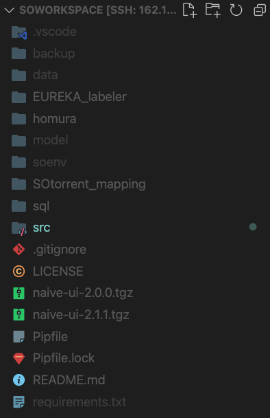

<h1 align="center">HIKARI</h1>
<h3 align="center">一种面向API初学者的API学习辅助服务</h3>

<b>（因为是初学者，所以还只支持JDK，笑:-)</b>

<a href="README_en.md">English</a> | 中文

  

## 项目背景与简介

### 1.项目背景

开发者经常使用其它开发者或开发商的SDK、使用其中的各种模块及API完成自己的软件开发，因此时长面临对某SDK中众多模块、API使用方法的学习需求。通常，开发者从以下途径学习开发所需的知识：

  - 1、官方文档：官方文档提供详细的API信息及SDK整体结构信息，但仅限于每个API的解释而没有对实际使用中涉及的知识进行讨论、仅适合十分有经验的开发者进行查阅
  - 2、官方sample：并不是所有SDK开发商都提供完善的sample可供参考，且sample也只能覆盖一部分SDK使用场景
  - 3、第三方博客、教程：博客或教程都由他人写成、分散在网络各处、难以整理，且一篇博客往往只涉及一小部分相关知识，开发者非常难以通过博客对SDK的使用进行系统学习
  - 4、Stack Overflow：SO以问答形式、用crowd source的力量集中了大量的实际开发知识，但是SO是一个以问答文档为中心的论坛系统、仅能对文档的字面信息进行搜索，这造成了探索SO这个知识库时主要面临两个困难：
      - 知识库的可导航性：SO用户无法以知识为中心组织SO中的帖子，只能进行被动搜索，无法充分利用其中丰富的知识作为学习资源
    - 搜索查询的制定或重新制定：对于某些编程知识不足的新手，精确表达其信息需求极其困难

同时，初学者在进行学习时，经常面临SDK中成千上万的API，如果没有指导，初学者对这些API的学习就还面临以下问题：

* 缺乏主次，找不到合适的学习入口：即初学者不知道该从哪些API开始学习。
* 难以规划自己的学习路径：从学习入口开始学习后，不知道该如何以合适的顺序、循序渐进地学习所有常见的API。

### 2. 项目简介

项目主要提供了以下几个方面的功能：

1. 构建了JDK的API知识图谱，该知识图谱主要包含了若干的API实体以及API之间的各类关系。该图谱是可以可视化的（有关图谱可视化的效果，可以参见子项目Project HOMURA），可视化的图能够让初学者对于各种API之间的关联产生更加直观的认识，从而**能够更加便捷地规划自己对于API的学习路径**
2. 连接了每个API和与之相关的Stack Overflow讨论帖：对SO中的知识，从API的视角进行了重新组织，初学者可以更方便地**找到API相关的学习资源**
3. 提供了**API学习入口的推荐与API学习入口的搜索**：完全的初学者只需要遵循系统引导就可以找到推荐的学习入口开始对API的学习，同时学习者也可以使用基于API知识图谱中的搜索系统对API学习入口进行搜索。

注：这里的API学习入口是**一组**关系密切的API，不是一个API，因为API是被展示在API知识图谱中的，当学习者开始学习时，他会查看API知识图谱的一个局部子图，初步查看学习入口中API之间的相互关系，这个局部子图就包含了一组的API。

项目的总体架构如下图：

## 项目结构

项目主要结构如图所示：

项目的根目录下主要有以下文件夹：

* src：项目后端的所有主要代码都位于 src 中，在 src/config.py 中存储所有的可变配置
* sql：项目使用了SOtorrent数据集，sql中的脚本是为了在服务器的MySQL中写入SOtorrent的数据。当然，你也可以直接在服务器的MySQL中写入SOtorrent数据集而无需理会这些sql
* SOtorrent_mapping：一个D2RQ的mapping文件，理论上可以将SOtorrent这个关系型数据库导出成RDF，但是本项目最终没有这么干
* soenv：项目使用了virtualenv，soenv是项目的virtualenv虚拟环境所在目录，python版本要求大于python 3.7。你可以像本项目一样自建一个virtualenv，或者干脆就安装所有项目的依赖就行。
* model：存储了项目中除了两个BERT模型外几乎所有的模型，包括：
  * 一个在apidoc和Wikipedia上联合训练的fasttext
  * 一个node2vec模型（没用到）
  * 一个在SO讨论帖数据集上训练的doc2vec模型
* data：项目中使用的所有数据
* backup：也是数据，不过只是用来备份项目产生的知识图谱中间结果的
* EUREKA_labeler：EUREKA的数据标注器子项目，后文阐述
* homura：项目前端，子项目HOMURA，后文阐述

## 项目数据

## TODO

1. 在 HERMES 的抽取过程中，去除 API 描述中的代码片段
