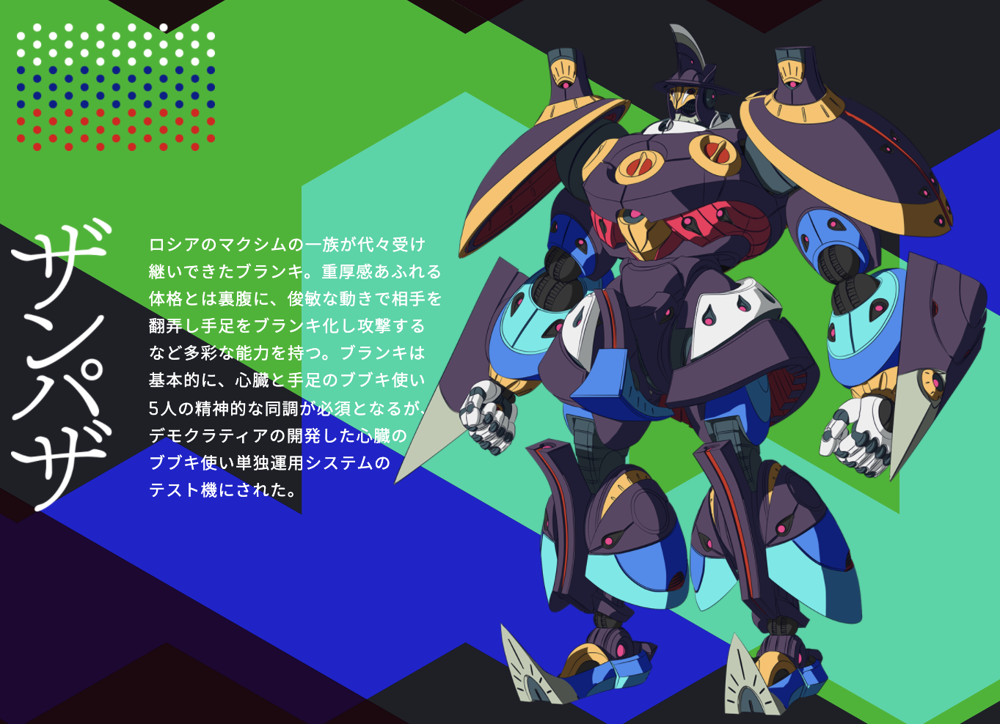

<h1 align="center">HIKARI</h1>
<h3 align="center">一种面向API初学者的API学习辅助服务</h3>
<p align="center"><b>（因为是初学者，所以还只支持JDK，笑:-)</b></p>

<p align="center"><a href="README_en.md">English</a> | 中文</p>

<p align="center">
  
</p>


## 项目背景与简介

### 1.项目背景

开发者经常使用其它开发者或开发商的SDK、使用其中的各种模块及API完成自己的软件开发，因此时长面临对某SDK中众多模块、API使用方法的学习需求。通常，开发者从以下途径学习开发所需的知识：

  - 1、官方文档：官方文档提供详细的API信息及SDK整体结构信息，但仅限于每个API的解释而没有对实际使用中涉及的知识进行讨论、仅适合十分有经验的开发者进行查阅
  - 2、官方sample：并不是所有SDK开发商都提供完善的sample可供参考，且sample也只能覆盖一部分SDK使用场景
  - 3、第三方博客、教程：博客或教程都由他人写成、分散在网络各处、难以整理，且一篇博客往往只涉及一小部分相关知识，开发者非常难以通过博客对SDK的使用进行系统学习
  - 4、Stack Overflow：SO以问答形式、用crowd source的力量集中了大量的实际开发知识，但是SO是一个以问答文档为中心的论坛系统、仅能对文档的字面信息进行搜索，这造成了探索SO这个知识库时主要面临两个困难：
      - 知识库的可导航性：SO用户无法以知识为中心组织SO中的帖子，只能进行被动搜索，无法充分利用其中丰富的知识作为学习资源
    - 搜索查询的制定或重新制定：对于某些编程知识不足的新手，精确表达其信息需求极其困难

同时，初学者在进行学习时，经常面临SDK中成千上万的API，如果没有指导，初学者对这些API的学习就还面临以下问题：

* 缺乏主次，找不到合适的学习入口：即初学者不知道该从哪些API开始学习。
* 难以规划自己的学习路径：从学习入口开始学习后，不知道该如何以合适的顺序、循序渐进地学习所有常见的API。

### 2. 项目简介

项目主要提供了以下几个方面的功能：

1. 构建了JDK的API知识图谱，该知识图谱主要包含了若干的API实体以及API之间的各类关系。该图谱是可以可视化的（有关图谱可视化的效果，可以参见子项目Project HOMURA），可视化的图能够让初学者对于各种API之间的关联产生更加直观的认识，从而**能够更加便捷地规划自己对于API的学习路径**
2. 连接了每个API和与之相关的Stack Overflow讨论帖：对SO中的知识，从API的视角进行了重新组织，初学者可以更方便地**找到API相关的学习资源**
3. 提供了**API学习入口的推荐与API学习入口的搜索**：完全的初学者只需要遵循系统引导就可以找到推荐的学习入口开始对API的学习，同时学习者也可以使用基于API知识图谱中的搜索系统对API学习入口进行搜索。

注：这里的API学习入口是**一组**关系密切的API，不是一个API，因为API是被展示在API知识图谱中的，当学习者开始学习时，他会查看API知识图谱的一个局部子图，初步查看学习入口中API之间的相互关系，这个局部子图就包含了一组的API。

项目的总体架构如下图：

## 项目结构

项目主要结构如图所示：

<p align="center">
  
</p>

项目的根目录下主要有以下文件夹：

* `src`：项目后端的所有主要代码都位于 src 中，在 src/config.py 中存储所有的可变配置
* `sql`：项目使用了SOtorrent数据集，sql中的脚本是为了在服务器的MySQL中写入SOtorrent的数据。当然，你也可以直接在服务器的MySQL中写入SOtorrent数据集而无需理会这些sql
* `SOtorrent_mapping`：一个D2RQ的mapping文件，理论上可以将SOtorrent这个关系型数据库导出成RDF，但是本项目最终没有这么干
* `soenv`：项目使用了virtualenv，soenv是项目的virtualenv虚拟环境所在目录，python版本要求大于python 3.7。你可以像本项目一样自建一个virtualenv，或者干脆就安装所有项目的依赖就行。
* `apidoc`：存储作为项目数据源的apidoc。
* `model`：存储了项目中除了两个BERT模型外几乎所有的模型，包括：
  * 一个在apidoc和Wikipedia上联合训练的fasttext
  * 一个node2vec模型（没用到）
  * 一个在SO讨论帖数据集上训练的doc2vec模型
* `data`：项目中使用的所有数据
* `backup`：也是数据，不过只是用来备份项目产生的知识图谱中间结果的
* `EUREKA_labeler`：EUREKA的数据标注器子项目，后文阐述
* `homura`：项目前端，子项目HOMURA，后文阐述

## 项目数据

在项目的github仓库中，仅包含`src`、`sql`、`SOtorrent_mapping`、`homura`、`EUREKA_labeler`这几个与代码相关的文件夹。剩余的文件夹涉及到了大量的数据，因此它们被分享到了百度网盘：

**链接: https://pan.baidu.com/s/1AFtvdk9F6J0vHBeNwkwwBw  密码: cwwt**
要复原项目中的所有数据，需要下载该共享文件夹内的安装包，并将这些安装包都解压到项目根目录。

在所有数据中，`soenv.zip`是在windows 10机器下项目virtualenv文件夹的完整拷贝，并不一定需要此文件夹来复现项目。

在`apidoc.zip`中，可以发现解压后里面还有一个压缩包，需要将这个压缩包也进行解压，并放置于apidoc文件夹中。

## 项目部署

### 1. 环境配置

该项目是一个web服务，有前端与后端两部分，其中后端部分包含大量对SO与JDK文档进行数据分析的数据分析python脚本，后端本身也是用python的flask框架写成。前端则位于`homura`文件夹中，是该项目的一个子项目。

有关前端的部署，请参见`homura/README.md`。这里主要解释如何运行后端数据分析与flask服务器。

首先，需要确保部署机器中包含Python 3.7或以上版本。推荐使用python 3.7以上的python建立virtualenv环境：

```shell
pip install virtualenv
virtualenv -p python3.7 soenv
```

接下来，需要安装项目所有的python依赖。目前项目总结了在windows 10系统下项目需要安装的所有依赖，放置于项目根目录下的`requirements-windows10.txt`，可以用来安装：进入virtualenv环境后，输入

```shell
pip install -r requirements-windows10.txt
```

最后，下载上面提到的所有项目数据并解压，理论上就可以复现本项目的数据处理流程了。

### 2. 路径配置

项目用了一种比较笨的配置方法来识别本项目的根路径以及目前的运行平台。

进入`src/util/config.py`，你会发现前几行是这样的：

````python
JAVADOC_GLOBAL_NAME = 'javadoc'
WINDOWS = 'WINDOWS'
MAC = 'MACINTOSH'
UBUNTU = 'UBUNTU'
CURRENT_PLATFORM = UBUNTU

WORD_EMBEDDING_DIMENTION = 100


# 判断当前运行的项目基础路径及运行平台
if os.path.exists('C:/workspace/SOworkspace'):
    base_dir = 'C:/workspace/SOworkspace'
    CURRENT_PLATFORM = WINDOWS
elif os.path.exists('/media/dell/disk/yinh/SOworkspace'):
    base_dir = '/media/dell/disk/yinh/SOworkspace'
    CURRENT_PLATFORM = UBUNTU
elif os.path.exists('/root/SOworkspace'):
    base_dir = '/root/SOworkspace'  # 部署环境
    CURRENT_PLATFORM = UBUNTU
elif os.path.exists('/User/yinhang/workspace/SOworkspace'):
    base_dir = '/User/yinhang/workspace/SOworkspace'
    CURRENT_PLATFORM = MAC
else:
    base_dir = '/media/dell/disk/yinh/SOworkspace'
````

由于项目开发者本人（我=——=）在上述三个平台下开发项目时，项目的根路径就是代码里写的这样，所以开发者把三个平台下项目的根目录路径写死了，并且用这个路径来判断项目当前的运行平台（不过大部分脚本都应该是平台通用的）。

所以如果想要复现本项目，则需要将相应运行平台的项目根路径进行更改，换成你的路径。

## 项目组成

项目主要由以下几个部分组成，我们可以结合项目简介中给出的整体项目结构图查看。

项目的每个部分都是一系列的Python数据处理脚本，用顺序的标号做了顺序上的排序，理论上只要按顺序运行脚本即可完成对应部分的数据处理与数据准备。

### 1. HERMES

<p align="center">
  
</p>

宙斯的传旨者和信使，商业、旅者、小偷和畜牧之神。

Guess what，起这个名字是因为这是整个项目的开端，觊觎HERMES的速度，我起这个名字希望能赶紧把这玩意做完。

其实本来想叫BIRD_OF_HERMES，但是这个代号实在是太长了吧！

#### （1）职责

HERMES负责构建整个项目的根基：API知识图谱。但是，HERMES**仅负责从API文档中解析API实体及关系**，不负责论文中提及的SO讨论帖实体、领域术语实体等实体及相关关系的抽取。

#### （2）注意事项

HERMES基于`selenium`，且使用了Chrome的webdriver。在运行HERMES之前，**必须安装Chrome的webdriver，以使得`selenium`可以正确使用**。在windows环境下，可以尝试用`chocolatey`直接安装Chrome的webdriver，这是开发者本人选用的方案。

```shell
choco install chromedriver
# 必须先安装chocolatey
```

#### （3）解析

##### HERMES_1-concept_map_generation.py

此步骤生成了作为项目根基的API知识图谱。实现思路为：

1. 使用`selenium`遍历javadoc中所有类、接口、枚举、异常（一切有独立页面的API元素）的web页面，并使用`selenium`API解析其中的html标签，以发现所有的API元素，并作为API实体添加到知识图谱中
2. 添加完所有API实体后，再遍历一遍文档，这次通过html标签发现文档中纪录的API之间的关系，并在API实体之间添加关系
3. 存储API知识图谱到指定路径。

注：

项目使用了`networkx`来操作和存储知识图谱，知识图谱被导出为gexf的格式。

实际上知识图谱就是一个图嘛，这个我们数据结构都学过，我的gexf中存的实际就是一张有向图，里面的每个节点都有若干属性，像一个json一样，边同样也有属性。这样知识图谱的数据就存储起来。如果想知道如何使用`networkx`操作、读取、存储知识图谱，那么你可能需要先搜索一下`networkx`然后随便看看什么大街上的人写的教程，并且自己试一试，应该就能理解这个库的基本用法。

刚才说了API知识图谱在这里就是一张`networkx`的图，图里的节点和边都是有附着属性的，相当于可以把每个结点和边都当成json对象看。我们看看节点上和边上都有哪些属性。

API知识图谱中的结点有以下属性：

1. name：结点的唯一标识，对于API来说，是它在API文档中的相对路径名。
2. Ntype：结点（实体）的种类，可能是某种API（class、method啥的），也可能是其它的实体（比如domain term啥的），实体的具体种类定义在`src/util/constant.py/NodeType`里。
3. Local_href：如果结点是个API实体，那它会有一个对应的本地API文档web页面文件的路径。不过估计这个属性只有在开发者本人的机子上才好使，因为你们把项目的根路径改了。其实这东西基本没用了，只是构建时的副产物。
4. description：如果结点是个API实体，它会有个简短的一句话描述。
5. path：API实体对应的文档web页面的相对路径，如果是API实体那这个属性应该就和name是一样的，你可以在前面拼接文档的根目录地址来获得该API对应的web页面。挺智障的这个设计，但是发觉过来的时候已经改不了了。
6. alias：有的结点可能有别名，但是有的可能没有
7. community_freq：一个API实体在SO讨论帖中被讨论的次数。**但是！**这个玩意是通过直接在SO的帖子里文字搜索API名字实现的，一点也不精准！**后期直接被废弃了！**
8. qualified_name：API的全限定名，比如什么java.lang.Thread这种
9. additional_properties：多余的乱七八糟的属性，你基本可以无视它

边大概有以下属性：

1. Etype：边的类型，有require、inherit、implement之类的，也就是关系的类型。具体的关系类型定义在了`src/util/constants.py/EdgeType`里
2. cooccur_freq：两个API实体在SO中被共同讨论的次数。只在community map（社区知识图谱）里出现，如果你看了我的论文，你大概能理解社区知识图谱是个什么玩意，总之它实际是从API知识图谱里摘下来的一小部分。
3. cooccur_threads：两个API共同出现的SO帖子的thread_id的纪录，也是只在社区知识图谱里出现
4. wikipedia_label：从别人那嫖过来的，wikipedia term实体之间可能有的关系的类型，根本没用到过

具体的这些东西的定义可以参见`src/util/constants.py`，里面基本定义了本项目中用到的绝大部分常量。

HERMES 1的代码里面基本啥玩意都没有，主要的知识图谱构建逻辑写在了`src/util/concept_map/apidoc_concept_map_generator.py`里。看这个文件里的`generate_concept_map`函数你会发现这玩意是可扩展的，你可以把工作扩展到别的API doc，不过我肯定不做了，再见。

##### HERMES_1.5-add_community_frequency_info.py

HERMES 1.5这个步骤向API知识图谱中的API实体增加了community_freq属性。算是API知识图谱构建的后续补充，所以它是1.5

具体做法就是直接上SO的帖子里搜索API的名字，看能出现几次。

这做法就很扯，抽出来的东西也没啥参考意义，所以就跟属性描述里说的一样，这个属性已经废弃了，你要不跑这一步也行，反正跑着玩也行吧。

不过这一步是通过pymysql进行sql查询实现的。所以要是跑的话，你要做好以下的准备：

1. 有一台上面装了mysql、**mysql里还存着SOtorrent数据集**的服务器，SOtorrent它怎么装到服务器的mysql里呢？你可以看看他们的官方网站：[The SOTorrent Dataset - empirical-software.engineering](https://empirical-software.engineering/sotorrent/)
2. 正确配置你的服务器地址、mysql用户名和密码、sotorrent数据库的名字，这些都在`src/util/config.py`最底下那里，你需要把他改成自己的mysql数据库的配置

##### HERMES_2-collect_javadoc_concept_description.py 

API知识图谱里每个API实体有个description属性是这个API的一句话描述。不过这个一句话描述还是太简短了，实际上文档里还有每个API的详细描述，每个详细描述都是一篇文章那么长。

因为不想在知识图谱里存太复杂的信息，每个api的详细描述被单独存在了一个json里，就是这个`data/apidoc_description/javadoc_descriptions.json`，HERMES 2就是专门为了生成这个文件的。这个文件是json，所以你直接打开就能明白里面是什么格式的了，实际就是一个词典。

##### HERMES_3-crawl_javadoc_concept_bing_explanations.py

从bing上爬取了每个API相关的bing搜索结果。

这个是项目初始的一个愚蠢验证想法，definitely已经废弃了，不要跑它，不过你要跑着玩也行，可以用它改一个bing爬虫出来（笑。

### 2. EZA-PIPELINE

EZA-PIPLINE不是一个单独步骤，而是由三个依次相连的部分组成的流水线。包含三个组成部分：EUREKA、ZAMPATHA和ANEMONE。实际上，这个部分就是在SO帖子中做了一个API命名实体链接，因此这三部分也对应着命名实体识别、候选实体生成和候选实体消歧。

EZA-PIPELINE的职责是向API知识图谱中加入SO讨论帖，建立API实体与SO讨论帖的关联。在实际实现中，因为不想向知识图谱本体文件中输入太多信息，所以API与SO的关联信息是写在一个单独的json文件中的。在服务器的`/media/dell/disk/yinh/torch`部分依次运行EUREKA、ZAMPATHA、ANEMONE的predict文件，就能得到最终的输出`/media/dell/disk/yinh/torch/ANEMONE/whole_simple_prediction_sync/all_predictions.json`，我在windows机器上也拷贝了一份，这个文件在`./data/server_data/ANEMONE_prediction/all_predictions_sync.json`，你应该可以找到它，里面纪录了API名字和SO中讨论帖id的关联关系。

EZA-PIPELINE的主要代码都保管于本组服务器的`/media/dell/disk/yinh/torch`，没有与github进行同步，后面会考虑同步，在本仓库中的相关代码基本都是为了给模型准备数据，而没有用到的模型本身的代码。

#### （1）EUREKA

<p align="center">
  
</p>

古希腊词语，意为“我发现了/我找到了！”。顺带一提，也是《交响诗篇》女主的名字（笑

EUREKA的主要任务就是做API命名实体识别，通过使用一个基于BERT和空洞卷积的模型，识别SO讨论帖中的API实体指称（建议和论文一起观看，你大概就能理解）。

##### EUREKA_1-collect_java_related_so_posts.py

EUREKA 1首先从SOtorrent中整理、预处理所有的SO讨论帖，将讨论帖数据转化为以下格式：

```json
{
        "Id": 32913709,
        "Body": "<p>When the Gang of four introduced the singleton pattern, they also had to explain, why not to use static class fields and method instead. The reason was: the possibility to inherit. For Java it had sense - we cannot normally inherit the class fields and methods.</p>&#xA;&#xA;<p>Later the \"Effective Java\" book appeared. And we know now that the existence of reflection destroys the singularity of the singleton class with private constructor. And the only way to make a real SINGLEton is to make it as a single item of an enumeration. Nice. I had done some myself this way.</p>&#xA;&#xA;<p>But a question remains: While we cannot inherit from enumeration, what is the use of this singleton? Why we don't use these old good static/class fields and methods? </p>&#xA;&#xA;<p>Edit. Thanks to the @bayou.io I see that in <a href=\"https://softwareengineering.stackexchange.com/a/204181/44104\">https://softwareengineering.stackexchange.com/a/204181/44104</a> there is a code that can trick the enum, too, and create again two exemplars of the enum singleton. The other problems are mentioned there, too. So, there is no need to use enum instead of the usual singleton class pattern, too? BTW, all enum pluses that are mentioned here till now, work for singleton classes, too. </p>&#xA;",
        "Tags": "<java><design-patterns><singleton>",
        "Title": "What is the use of the enum singleton in Java?",
        "Score": 7,
        "ViewCount": 782,
        "FavoriteCount": 2,
        "Answers": [
            {
                "Body": "<p>There's nothing particularly wrong with the \"good old fashioned singleton\", enum \"singletons\" are just convenient - it saves you the need to muck around with boiler-plated code that looks the same in every singelton.</p>&#xA;",
                "Score": 2,
                "Accepted": false
            },
            {
                "Body": "<p>To me, a singleton makes sense wherever you want to represent something which is unique in its kind. </p>&#xA;&#xA;<p>As an example, if we wanted to model <em>the</em> <code>Sun</code>, it could not be a normal class, because there is only one <code>Sun</code>. However it makes sense to make it inherit from a <code>Star</code> class. In this case I would opt for a static instance, with a static getter.</p>&#xA;&#xA;<p>To clarify, here is what I'm talking about :</p>&#xA;&#xA;<pre><code>public class Star {&#xA;    private final String name;&#xA;    private final double density, massInKg;  &#xA;&#xA;    public Star(String name, double density, double massInKg) {&#xA;        // ...&#xA;    }&#xA;&#xA;    public void explode() {&#xA;       // ...&#xA;    }&#xA;}&#xA;&#xA;public final class Sun extends Star {&#xA;    public static final Sun INSTANCE = new Sun();&#xA;&#xA;    private Sun() { super(\"The shiniest of all\", /**...**/, /**...**/); }&#xA;}&#xA;</code></pre>&#xA;&#xA;<p><code>Sun</code> can use all the methods of <code>Star</code> and define new ones. This would not be possible with an enum (extending a class, I mean).</p>&#xA;&#xA;<p>If there is no need to model this kind of inheritance relationships, as you said, the <code>enum</code> becomes better suited, or at least easier and clearer. For example, if an application has a single <code>ApplicationContext</code> per JVM, it makes sense to have it as a singleton and it usually doesn't require to inherit from anything or to be extendable. I would then use an <code>enum</code>.</p>&#xA;&#xA;<p>Note that in some languages such as Scala, there is a special keyword for singletons (<code>object</code>) which not only enables to easily define singletons but also completely replaces the notion of static method or field.</p>&#xA;",
                "Score": 1,
                "Accepted": false
            },
            {
                "Body": "<p><strong>what is the use of this singleton? Why we don't use these old good static/class fields and methods?</strong></p>&#xA;&#xA;<p>Because <code>enum</code> is an object so it can not only be passed around but also implement interfaces.</p>&#xA;&#xA;<p>Also since we are making a class, we can use the different public/private options available to all kinds of classes.</p>&#xA;&#xA;<p>So in practice, we can make a singleton that implements an interface and then pass it around in our code and the calling code is non the wiser.  We can also make the enum class package private but still pass it around to other classes in other packages that expect the interface.</p>&#xA;&#xA;<p>If we used the static methods version, then the calling class would have to know that this object is a singleton, and our singleton class would have to be public so the other classes can see it and use it's methods.</p>&#xA;",
                "Score": 3,
                "Accepted": true
            },
            {
                "Body": "<ol>&#xA;<li><p><strong><em><code>ENUM</code></em></strong> singletons are easy to write. It will occupy very less code, which is clean  &amp; elegant if you compare with implementation of lazy singleton with double synchronized blocks  </p>&#xA;&#xA;<pre><code> public enum EasySingleton{&#xA;    INSTANCE;&#xA;}&#xA;</code></pre></li>&#xA;<li><p>Creation of <strong><em><code>ENUM</code></em></strong> instance is thread safe. </p></li>&#xA;<li><p><strong><em><code>ENUM</code></em></strong> singletons handled serialization by themselves.</p>&#xA;&#xA;<p>conventional Singletons  implementing <code>Serializable</code> interface are no longer remain Singleton because <code>readObject()</code> method always return a new instance just like constructor in Java. you can avoid that by using <code>readResolve()</code> method and discarding newly created instance by replacing with Singeton</p>&#xA;&#xA;<pre><code>private Object readResolve(){&#xA;    return INSTANCE;&#xA;}&#xA;</code></pre></li>&#xA;</ol>&#xA;&#xA;<p>Have a look at this <a href=\"http://javarevisited.blogspot.in/2012/07/why-enum-singleton-are-better-in-java.html\" rel=\"nofollow\">article on singleton</a></p>&#xA;",
                "Score": 0,
                "Accepted": false
            }
        ],
        "Links": [
            "https://softwareengineering.stackexchange.com/a/204181/44104",
            "http://javarevisited.blogspot.in/2012/07/why-enum-singleton-are-better-in-java.html"
        ]
    }
```

这一步骤同样需要有SOtorrent数据集的mysql，如果你不想跑也没关系，我data里都给你生成好了，在`./data/so_posts/java/`里。

##### EUREKA_1.1-generate_so_posts_segment_info.py

如果你实际看了`./data/so_posts/java/`里面，你会发现它是三十几个pkl文件，也就是pickle序列化的文件。这里每个文件都是一个SO讨论帖的列表（SO讨论帖每个都是一个json对象，像上面的例子一样）。为了后续能快速根据帖子的id找到这篇帖子到底在哪个文件的第几个，EUREKA 1.1为整个生成的帖子数据集做了一个索引，生成的索引文件可以帮助通过讨论帖id快速找到讨论帖在这一堆文件中的位置。

后来想想为啥要用文件呢，其实用个mongodb啥的也不错，不过反正都做出来了就这样吧。

##### EUREKA_1.5-extract_ref_in_SO_posts.py

从SO讨论帖中抽取所有的超链接。

如果你有看过我论文的论述，你应该记得EUREKA的训练数据集是首先通过自动化收集SO讨论帖中指向API文档的超链接得来的，这一步就是不管指不指向API文档，总之先抽取出了所有超链接，并纪录在了SO讨论帖数据集中的Links字段（你可以看上面的那个讨论帖数据结构例子，那个Links是后抽取出来的，就在这一步）。

##### EUREKA_2-prepare_NER_trainset_from_posts.py

把讨论帖切成了一句话一句话的。然后在每个句子里看句子里的超链接是否指向JDK的API文档。

是否指向JDK文档是通过正则表达式判断的，正则表达式如下：

```python
# 不同SDK文档API URL的正则匹配表示，因为仅用根URL还会匹配到教程啥的很难搞
APIDOC_API_URL_REGEX_PATTERN = {
    JAVADOC_GLOBAL_NAME: r'^(http://|https://)?docs.oracle.com.+api.*$'
}
```

如果后续要做别的文档，这个匹配API文档路径的正则你得自己编。

不过这个自动生成的训练集有质量问题，这个在论文里也论述过了。

所以这个生成的数据被交给了EUREKA_labeler，你得把这步生成的数据放到`EUREKA_labeler/lableler/public/static/`底下，然后开始标注。

标注好的所有文件我都放在了`data/EUREKA_refine_label`里面

##### EUREKA_2.1-prepare_NER_dataset_from_refined_label.py

由于EUREKA 2生成的数据集有缺陷，我们使用了EUREKA_labeler进行了人工标注，重新生成了数据集，如上文所说。EUREKA 2.1把这些断断续续标的数据重新汇总成一个完整的API命名实体识别数据集

##### EUREKA_2.5-split_NER_train_test_set.py

按照一定比例，把生成并refine过的API命名实体识别数据集分成训练集和测试集。

至此，EUREKA的数据集准备完成，模型本身则放在了服务器上。

#### （2）ZAMPATHA

ZAMPATHA是这玩意，一个毛子的舞乱伎，我估计你也不知道我在说啥（滑稽



ZAMPATHA的任务是做每个API实体指称生成候选API实体。这一步是使用elasticsearch搜索完成的。

注：要运行ZAMPATHA，你需要在服务器上安装elasticsearch并在`src/util/config.py`最底下配置elasticsearch的地址、端口，推荐可以使用docker安装：

[elasticsearch (docker.com)](https://hub.docker.com/_/elasticsearch)

##### ZAMPATHA_1-insert_api_into_elasticsearch.py

把所有API实体连同其一句话描述都插入elasticsearch以供搜索。**一定要先装elasticsearch并配置好地址和端口啊**

##### ZAMPATHA_1.1-insert_api_into_elasticsearch_strict.py

第一版这个做出来结果不太好，ZAMPATHA 1.1对插入方式进行了优化，干的跟ZAMPATHA 1是完全一样的事情，你可以就直接跑这个无视ZAMPATHA 1。

之后ZAMPATHA的实际搜索部分还是在服务器上，没有进行git同步。

#### （3）ANEMONE

EUREKA都有了，这结尾肯定要给她整个安妮莫奈对仗（


ANEMONE的任务是做最后的候选实体消歧。也就是这其实是一个匹配模型，把API实体指称出现的语境和候选API的语义进行匹配，选出最可能匹配的那个候选API实体。

##### ANEMONE_1-prepare_NEL_dataset_from_posts.py

和EUREKA同样是自动从SO讨论帖中收集数据集，只不过这次是为消歧模型收集数据。同样还是利用了讨论帖中天然存在的指向API的超链接。

*大概步骤：*

*1. 遍历post，找到其中和API关联的mention（检测<a>标签，识别路径）*

*2. 为mention找到候选实体，其中一个正例（API文档路径精确匹配），三个反例（mention与API name的公共序列达到3以上）*

*3. 每个候选实体构建一个case，包含信息：*

​    *（1）mention与对应concept map中的候选实体ID（即候选实体的context）*

​    *（2）mention的context（整个thread的数据）*

​    *（3）是否匹配的label*

##### ANEMONE_1.1-prepare_xgboost_NEL_dataset.py

ANEMONE 1生成了完整的消歧数据集，之后根据消歧可能应用的不同模型要对消歧数据集进行进一步的格式变换，生成不同模型专用输入的数据集。

在探索阶段，为ANEMONE进行了不同模型的实现，并观察哪个效果更好。

ANEMONE 1.1为基于xgboost的ANEMONE模型准备数据集。基本上就是在做常规的数据格式转换。

##### ANEMONE_1.2-prepare_BERT_NEL_dataset.py

ANEMONE 1.2为基于BERT的ANEMONE模型准备了数据集。

##### ANEMONE_1.3-prepare_BERT_NEL_dataset_refined.py

ANEMONE 1.3还是准备的BERT模型的数据集。

不过1.3在处理时运用到了EUREKA_labeler的标注结果。只有被人工标注过、确定是API实体指称的数据才会被加入到ANEMONE的数据集中，因此相比1.2生成的数据整体拥有更高的精度。

##### ANEMONE_1.35-prepare_BERT_NEL_dataset_refined_V2.py

项目后期，ANEMONE BERT模型的架构进行了大的变更，输入数据的格式也变了，因此1.35负责生成新的数据集。

总之基本上来说1.2和1.3都废弃了，跑1.35好了（

##### ANEMONE_2.1-xgboost_nel.py

对于一些像xgboost这样的简单模型，我就直接放在这个项目里实现了，没单独放在服务器那个torch文件夹里。

ANEMONE 2.1就是命名实体消歧的一个xgboost简单实现，然后发现效果很烂嗯

##### ANEMONE_3.5-filter_whole_simple_prediction.py

ANEMONE初版的预测结果太差了，模型本身出了问题。所以用这个步骤拿启发式规则筛了一遍SO讨论帖和API的链接结果，让他至少能看。

ANEMONE模型改正之后，现在你应该不需要这个步骤了。

### 3. LAVENTHA

拉雯妲，yyds


#### （1）职责

LAVENTA的职责很简单，就是为了更好地展示与每个API相关的SO讨论帖，给它们做个重新排序，排序的准则如下：

1. 我在整个SO上训练了一个doc2vec模型，doc2vec向量和API的描述文本最接近的帖子会被优先展示。
2. 和论文里说的一样，我整了一个how to型帖子的关键词表，能够匹配这些关键词的帖子会被优先展示
3. 两种排序准则冲突时，优先展示how to类型的帖子

#### （2）解析

##### LAVENTHA_1-train_SO_doc2vec_model

在SO上训练了doc2vec的模型

##### LAVENTHA_2-resort_api_thread_map_by_doc2vec.py

根据上述的规则，对每个API相关的帖子进行了重新排序，这样能够以更加合理的顺序展示API相关的帖子。

### 4. MENIA

其实是xenoblade里的メリア，换了个字母（笑


#### （1）职责

MENIA负责面向完全初学者的API学习入口推荐，推荐的具体思路可以先参见论文。

看完论文后相信你大概能够理解，MENIA主要分为两个主要步骤：

1. 构建SO社区知识图谱（community map）
2. 通过louvain算法，从社区知识图谱中挖掘得到一个一个的API学习入口

#### （2）解析

##### MENIA_0.1-clear_and_refine_concept_map.py

MENIA 0.1对HERMES生成的API知识图谱做了一次清洗，因为发现之前生成的API知识图谱里有一些孤立的结点

##### MENIA_0.2-extend_ANEMONE_predictions.py

MENIA需要利用EZA-PIPELINE的预测结果（也就是API和SO讨论帖的链接纪录）。这里利用原先帖子中就存在的超链接，在预测结果上进行了扩展，最大化地丰富API与SO讨论帖的链接结果。

##### MENIA_0.3-transfer_all_predicted_APIs_to_classes.py

MENIA仅对学习者推荐类、接口这一等级的API，而不推荐方法等过细粒度的API，因为考虑到初学者不适于死抠细节，应该先看看有啥类。

这一步将预测中提到的所有method和filed都变为对应的class，这样可以将API变得更加集中，可能更有利于社群检测

##### MENIA_1-add_community_rel_into_concept_map.py

这个步骤生成了SO社区知识图谱。

采用了一种启发式算法来生成社区知识图谱，启发式规则为：

*两个API在社区的同一个thread中同时出现超过COMMUNITY_THRESHOLD次*，就将这两个API加入社区知识图谱

##### MENIA_2-api_community_detect.py

在社区知识图谱上进行louvain社群检测生成社群检测结果，每个社群就是一个推荐的学习入口。

##### MENIA_3-prepare_openke_dataset.py

无视这个步骤，它废弃了，而且想法有点脑残

##### MENIA_4-learning_content_recommendation.py

为每个推荐的学习入口筛选一个具有代表性的SO帖子，因为在HOMURA的推荐学习入口页面，需要展示一个当前学习入口的代表性讨论帖，来帮助初学者了解这个学习入口在讨论啥。

这里就是用了一个启发式方法，推荐什么观看量点赞数最高的，最好题目还有how to在里面的就完事了

##### MENIA_4.1-get_full_community_api_recommend_record.py

为每个推荐的学习入口筛选几个具有代表性的API，因为在HOMURA的推荐学习入口页面，需要展示一些当前学习入口的代表性API，来帮助初学者了解这个学习入口在讨论啥。

这里就是看看那些API连了最多的边，连了很多边证明它是比较中心的API。

##### MENIA_4.2-get_full_community_tags_recommend_record.py

为每个推荐的学习入口筛选几个具有代表性的SO tag，因为在HOMURA的推荐学习入口页面，需要展示一些当前学习入口相关的SO tag，来帮助初学者了解这个学习入口在讨论啥。

这里就是直接统计与当前学习入口中API相关联的SO讨论帖，看他们中都频繁出现哪些tag，然后给用户看。

### 5. DEUS-X-MACHINA

机械降神！翻译自希腊语ἀπό μηχανῆς θεός（apò mēkhanḗs theós）。意思是机关跑出的神在古希腊戏剧，当剧情陷入胶着，困境难以解决时，突然出现拥有强大力量的神将难题解决，令故事得以收拾、有个好结局。 


DEUS-X-MACHINA的职责是进行API学习入口的搜索。

不过，这东西的整体思路借鉴了很多复旦FSE 2019的APIkg-summary。

所以才叫它DEUS-X-MACHINA（笑

因为原创性不足，所以这部分在ICWS投稿里也被废弃了。

关于具体思路，可以去看完整的论文。


## TODO

1. 加入linux环境下的requirements.txt。
2. 加入深度学习模型构建的相关代码。
