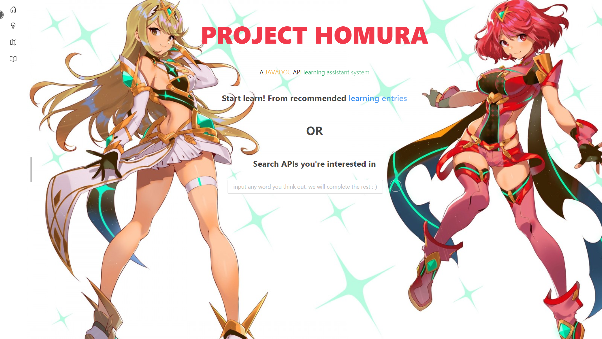

# Project HOMURA

An API learning assistant system developed by `vue 3` and `naive-ui`


Release V1.0.1

## HOME PAGE



## Project setup

```
npm install
```

### Compiles and hot-reloads for development

```
npm run serve
```

### Compiles and minifies for production

```
npm run build
```

### Lints and fixes files

```
npm run lint
```

### Customize configuration

See [Configuration Reference](https://cli.vuejs.org/config/).

### 注意事项

本项目为HIKARI的前端子项目。

项目在开发时，使用了尚未release的`naive-ui`。

因此，需要首先解压项目根目录的`naive-ui`压缩包（哪个版本都行），然后将解压后的文件夹重命名为`naive-ui`，并手动放入项目的`node_modules`。
